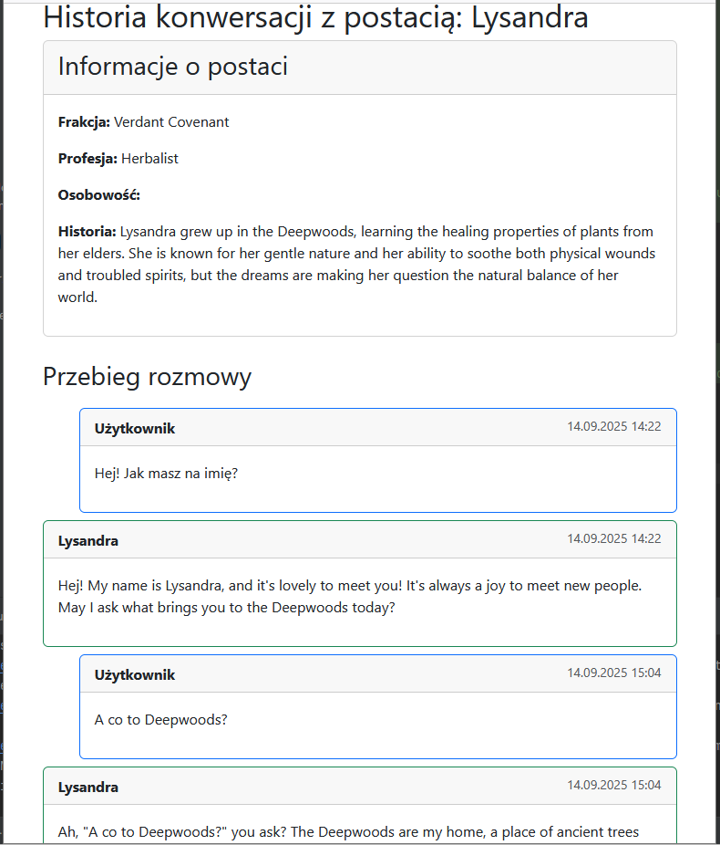

# NPC Generator API (Django + Gemini AI)

**NPC Generator API** an app powered by Gemini AI that creates and manages rich,
story-driven non-player characters (NPCs) from narrative prompts.

---

## 📋 Main Requirements

- Python 3.10
- Django 5.2
- djangorestframework 3.16.0
- google-genai

---

## 🛠️ Local installation

### 1. Prepare the environment

```bash
mkdir NPC_Generator_API
cd NPC_Generator_API
git clone https://github.com/marcin86junior/NPC-Generator-API .
cd NPC_Generator_API
python -m venv .venv
```

### 2. Activate the environment
- **Windows (PowerShell)**:
  ```bash
  .venv\Scripts\activate
  ```
- **Linux/macOS**:
  ```bash
  source .venv/bin/activate
  ```

### 3. Install dependencies
```bash
pip install -r requirements.txt
```

### 4. Configure the environment
Copy the `.env.template` file to '.env' in main folder and fill in the appropriate data:
GEMINI_API_KEY

### 5. Run migrations
```bash
python manage.py makemigrations
python manage.py migrate
```

### 6. Add story to db
```bash
python manage.py shell -c "from npc_api.models import Story; Story.objects.create(title='The Chronicles of the Sundered Realm', content=open('data/fantasy.md').read())"
```
or
```bash
http://127.0.0.1:8000/swagger/
POST /stories/
title: The Chronicles of the Sundered Realm
data from "data/fantasy.md"
```

or 
```bash
django-admin -> add story via admin panel
```

### 7. Create a superuser (not required)
```bash
python manage.py createsuperuser
```

### 8. Run the server
```bash
python manage.py runserver
http://127.0.0.1:8000/swagger/
```

### 9. How to run test it?
Go to `npc_api/tests` and fill the `GEMINI_API_KEY` in `test_settings.py`

### 10. Run test
```bash
python manage.py test
```

---

## 🐳 Run via Docker
1. Copy the `.env.template` file to `.env` in main folder and add GEMINI_API_KEY
2. docker-compose up -d --build
3. docker-compose up


---

## 🌐 Avaiable adresses
- App: http://127.0.0.1:8000/
- Swagger: http://127.0.0.1:8000/swagger/
- Admin: http://127.0.0.1:8000/admin/

---

## How to use the API?
- go to: http://127.0.0.1:8000/swagger/

1. Add story (POST /stories/) from fantasy.md or your own story
- title: The Chronicles of the Sundered Realm
- data from "data/fantasy.md"

2. Check story at (GET /stories/)

3. Ask question about story
- POST /stories/{story_id}/ask-question/
- question: "Tell me about the story. What is it about?"

4. Create name of character
- POST /stories/{id}/name/
- request: "Generate a female name for a brave knight that starts with the letter A."

5. Create person character
- POST /stories/{story_id}/generate-character/
- request: "Create a girl personality that is good, fair and honest."

We shold get a response like:
```json
{
  "id": 1,
  "story": 1,
  "name": "Elara Dawnlight",
  "faction": "The Verdant Covenant",
  "profession": "Guardian of the Grove",
  "personality_traits": [
    "Kind",
    "Honest",
    "Wise",
    "Protective"
  ],
  "background": "Born within the Deepwood, Elara has always felt a deep connection to the natural world, learning the ways of the forest and its secrets from the elders of her grove. She carries a deep sorrow for the Sundering's impact, believing in the inherent balance of nature and striving to heal its wounds and protect its inhabitants.",
  "created_at": "2025-09-14T10:27:24.746720Z"
}
```

### Conversation with NPC

1. Create good and bad personality (helpful and evil)
- "Create a personality that is good, fair and honest."
- "Create a personality that is bad, cunning, selfish and ruthless."

2. Talk to NPC:
- POST /characters/{id}/talk
- talk with good person -> message: "Hello, can you help me with broken hand? I need help only for 5 minutes?"

```json
  {
    "id": 1,
    "story": 1,
    "name": "Lysandra",
    "faction": "Verdant Covenant",
    "profession": "Herbalist",
    "personality_traits": [
      "Kind",
      "Empathetic",
      "Curious",
      "Optimistic"
    ],
    "background": "Lysandra grew up in the Deepwoods, learning the healing properties of plants from her elders. She is known for her gentle nature and her ability to soothe both physical wounds and troubled spirits, but the dreams are making her question the natural balance of her world.",
    "created_at": "2025-09-13T12:56:35.647936Z"
  },
```
answer:

```json
{
"response": "Of course, my dear! I'd love to help you. I'll prepare a soothing herbal compress that should bring relief. Take care, and in the meantime, I'll tell you about the miraculous properties of forest flowers.\n"
}
```

- talk with bad person -> message: "Hello, can you help with broken sword? I need help for 5 minutes?"

```json
  {
    "id": 4,
    "story": 1,
    "name": "Malazar Vane",
    "faction": "Remnant Assembly",
    "profession": "Magister and Court Advisor",
    "personality_traits": [
      "Cunning",
      "Ruthless",
      "Ambitious",
      "Calculating"
    ],
    "background": "Born into a minor noble house within the Remnant Assembly, Malazar quickly distinguished himself through his sharp intellect and manipulative nature, rising through the ranks by eliminating rivals and exploiting weaknesses. He has accrued significant influence over the Assembly's ruling council, using his position to further his own agenda, which is believed to involve solidifying his family's position and, ultimately, seizing greater power.",
    "created_at": "2025-09-14T10:32:57.144483Z"
  }
```

answer:

```json
{
"response": "Broken sword? Time is money, mortal. Unless you pay me well for my attention... and I, Malazar Vane, always find a way to seize the opportunity.\n"
}
```

### Conversation with NPC by prompter: 
- http://127.0.0.1:8000/conversations/1/history/
- you can change character id in url

<p align="center">
  
  <br>
  <em>Prompter interface for conversation with game characters</em>
</p>

### TODO
1. Add conversations model to db OK
2. Save conversation history of me and person I'm talking to OK
3. Create prompter to talk with characters OK
4. Use conversation history in CharacterConversation (last 10 messages) TODO
5. Translate prompter from Polish to English TODO
6. Move conversations/1/history/ to npc_api/urls.py TODO
6. Add tests for new endpoints TODO

### My notes
1. Gemini AI sometimes returns "Model is overloaded" error.
2. I just send 2-3 requests and it works. It's hard to say if it's my code or Gemini issue.
3. I added "story" model to handle multiple stories in db. 
4. If the game is at the beginning it should use fantasy-begin.md story.
5. Later, when the game progresses we can change story to fantasy-middle.md or fantasy-end.md
6. People from different areas, for example "Deepwoods", should have limited knowledge about other areas like "Ironhold Clans".
